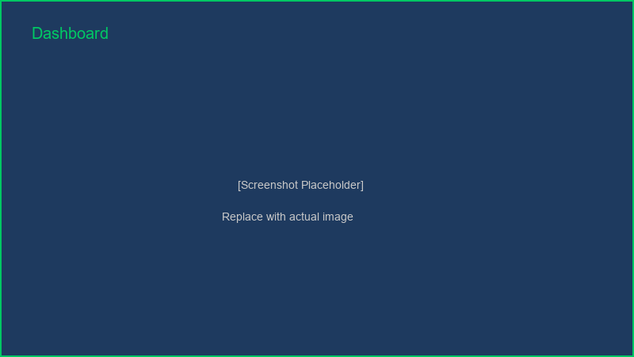
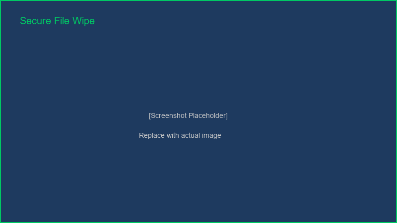
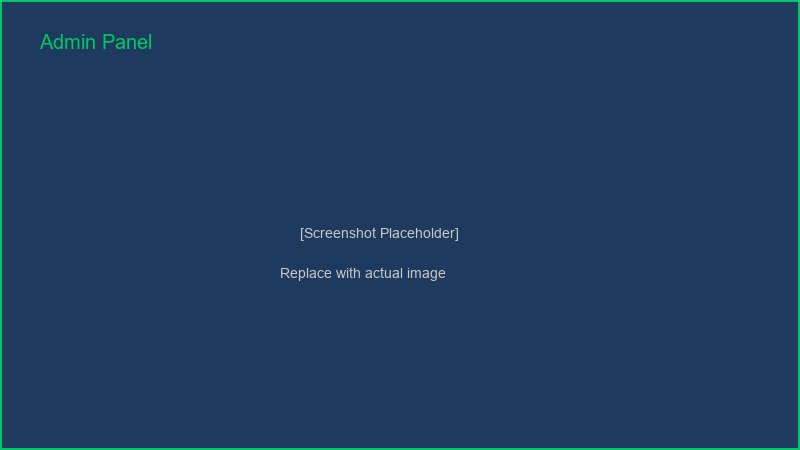
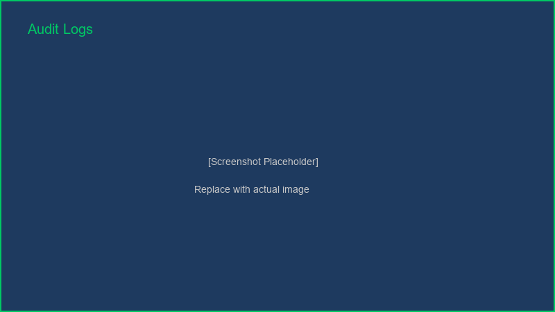
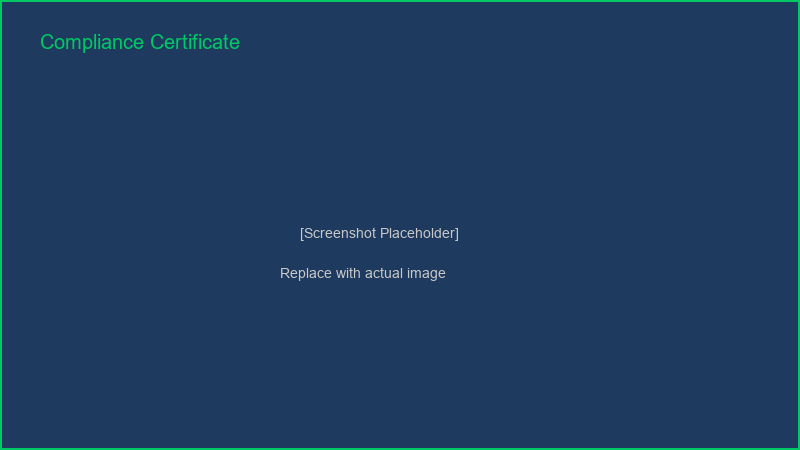

<div align="center">

# 🔐 SecureWipe Desktop

## **Enterprise-Grade Secure Data Destruction for Windows**

### Military-grade algorithms • Compliance-ready • Audit-proven • User-friendly

---

### 🎯 Key Features at a Glance

<table>
<tr>
<td align="center">🗑️<br><strong>5 Algorithms</strong><br>DoD, NIST, Gutmann</td>
<td align="center">📋<br><strong>Full Audit</strong><br>Complete History</td>
<td align="center">🛡️<br><strong>Compliance</strong><br>GDPR, HIPAA, PCI</td>
<td align="center">⚡<br><strong>Real-time</strong><br>Live Progress</td>
</tr>
</table>

---

### 🏆 Status & Tech Stack

[](https://www.python.org/)
[](https://www.riverbankcomputing.com/software/pyqt/)
[](#license)
[]()
[]()
[]()

---

[⬇️ Quick Install](#-quick-start) • [📖 Full Docs](#-table-of-contents) • [🚀 Build Guide](#️-building-from-source) • [🤝 Contribute](#-contributing)

</div>

---

## 📋 Table of Contents

- [✨ Features](#-features)
- [� Screenshots](#-screenshots)
- [�📋 Quick Start](#-quick-start)
- [🛠️ Installation](#️-installation)
- [💻 Building from Source](#-building-from-source)
- [📖 Usage Guide](#-usage-guide)
- [🔐 Supported Algorithms](#-supported-algorithms)
- [🏗️ Project Architecture](#️-project-architecture)
- [⚙️ Configuration](#️-configuration)
- [🆘 Troubleshooting](#-troubleshooting)
- [🤝 Contributing](#-contributing)
- [📄 License](#-license)

---

## ✨ Features

### 🔐 Core Capabilities

| Feature | Details |
|---------|---------|
| **5 Military Algorithms** | DoD 5220.22-M, NIST SP 800-88, Gutmann, Crypto, Simple |
| **Compliance** | GDPR, HIPAA, PCI-DSS, DoD Standards |
| **Audit Logging** | Complete operation history with timestamps & user context |
| **Real-time Monitoring** | Live progress updates with estimated time remaining |
| **File Management** | Local drives, external USB, folders, specific files |
| **Verification** | Certificate generation & cryptographic verification |
| **Modern UI** | PyQt6 interface with 5-page dashboard |
| **Batch Operations** | Multiple file/folder processing |
| **Scheduling** | Automated wipe operations (scheduled tasks) |
| **Email Reporting** | Operation summaries via email integration |

### 🛡️ Security & Compliance

- ✅ **Cryptographic Randomness** - Uses `secrets` module for secure RNG
- ✅ **Audit Chain** - Immutable operation records with blockchain-style hashing
- ✅ **Tamper Detection** - Detects unauthorized log modification
- ✅ **Multi-layer Verification** - PDF certificates with cryptographic signatures
- ✅ **User Authentication** - PIN-based access control
- ✅ **System Logging** - Tracks all user actions & device info
- ✅ **No Recovery Possibility** - Data overwritten multiple times per algorithm

### 🎯 Enterprise Features

- 📊 **Advanced Dashboard** - Statistics & usage analytics
- 🔔 **Notifications** - System tray alerts & sound notifications
- 🌐 **Multi-language** - English, Spanish, French support
- 🎨 **Custom Themes** - Dark/Light mode with customization
- 📁 **Batch Processing** - Schedule multiple wipes
- 📈 **Network Wipe** - Remote device data destruction
- 🔧 **Network Drive Support** - Clean network-mapped storage
- 💾 **Free Space Wiping** - Clear previously deleted file remnants

---

## � Screenshots

### Dashboard

*Main dashboard showing wipe statistics, system monitoring, and quick actions*

### Secure Wipe Interface

*File/folder selection with algorithm choices and verification options*

### Admin Panel

*Administrator controls with system information and configuration options*

### Audit Logs

*Complete operation history with timestamps, file paths, algorithms, and status*

### Compliance Certificate

*Automatically generated certificate of destruction for compliance documentation*

---

## �📋 Quick Start

### ⚡ **The Easiest Way (RECOMMENDED)**

**No Python or Installation Required!**

1. **📥 Download** the pre-built executable:
   - Go to [GitHub Releases](https://github.com/shlok926/secure-data-wipe-desktop/releases)
   - Download `SecureWipe.exe` (latest version)
   - Size: ~50-100 MB

2. **▶️ Run** the executable:
   - Double-click `SecureWipe.exe`
   - Click "Yes" when prompted for administrator rights
   - Application starts immediately!

**That's it!** 🎉 No terminal, no Python, no setup needed.

---

### 🛠️ Alternative: Build from Source (For Developers)

If you want to modify the code or build your own version:

```bash
# 1. Install Python 3.10+ and Git

# 2. Clone repository
git clone https://github.com/shlok926/secure-data-wipe-desktop.git
cd secure-data-wipe-desktop

# 3. Install dependencies
pip install -r requirements.txt

# 4. Run application
python secure_wipe_desktop.py

# 5. (Optional) Build standalone .exe
python build_exe.py
# Output: dist/SecureWipe.exe
```

---

## 🛠️ Installation

### ⚡ **EASIEST: Download Pre-built Executable**

Perfect for users who just want to use the application.

**No prerequisites needed!**

1. **Download from GitHub Releases:**
   ```
   https://github.com/shlok926/secure-data-wipe-desktop/releases
   ```
   - Look for the latest `SecureWipe.exe` file
   - Download to your computer

2. **Run the Application:**
   - Double-click `SecureWipe.exe`
   - Grant admin permissions if prompted
   - Application starts automatically

**That's all!** No Python, no terminal, no setup needed. ✅

---

### 🔧 **Advanced: Install Python Version**

For developers who want to modify or contribute code.

**System Requirements:**

| Component | Requirement |
|-----------|-------------|
| **OS** | Windows 10 or Windows 11 |
| **Python** | 3.10 or higher |
| **RAM** | 2 GB minimum, 4 GB recommended |
| **Disk Space** | 500 MB free |
| **Permissions** | Administrator rights for wiping operations |

**Installation Steps:**

1. **Install Python:**
   - Download from [python.org](https://www.python.org/downloads/)
   - Choose Python 3.10 or higher
   - Check "Add Python to PATH"

2. **Clone Repository:**
   ```bash
   git clone https://github.com/shlok926/secure-data-wipe-desktop.git
   cd secure-data-wipe-desktop
   ```

3. **Install Dependencies:**
   ```bash
   pip install -r requirements.txt
   ```

4. **Run Application:**
   ```bash
   python secure_wipe_desktop.py
   ```

5. **Build Your Own .exe (Optional):**
   ```bash
   python build_exe.py
   # Creates: dist/SecureWipe.exe
   ```
cd secure-data-wipe-desktop

# Step 2: Create virtual environment (recommended)
python -m venv venv
venv\Scripts\activate  # Windows

# Step 3: Install dependencies
pip install -r requirements.txt

# Step 4: Run application
python secure_wipe_desktop.py
```

---

## 💻 Building from Source

For developers who want to modify the source code or build a custom version.

### Quick Setup (3 Steps)

```bash
# 1. Clone the repository
git clone https://github.com/shlok926/secure-data-wipe-desktop.git
cd secure-data-wipe-desktop

# 2. Install dependencies
pip install -r requirements.txt

# 3. Run the application
python secure_wipe_desktop.py
```

### Build Custom Executable

```bash
# Prerequisites: You have Python 3.10+ and dependencies installed

# Run the build script
python build_exe.py

# Your executable is ready at:
# dist/SecureWipe.exe
```

### Virtual Environment (Recommended for Development)

```bash
# Create virtual environment
python -m venv venv

# Activate it
# Windows Command Prompt:
venv\Scripts\activate
# Windows PowerShell:
venv\Scripts\Activate.ps1
# Linux/Mac:
source venv/bin/activate

# Install dependencies
pip install -r requirements.txt

# Now run or build
python secure_wipe_desktop.py  # Run
python build_exe.py             # Build exe
```

### Build Configuration

Edit `build_exe.py` to customize:

```python
# Application metadata
ICON_PATH = "icon.ico"        # Custom icon
VERSION = "2.0.0"              # Your version
COMPANY = "Your Company"       # Your name

# Output options
OUTPUT_DIR = "dist"
ONE_FILE = True                # Single exe file

# PyInstaller options
HIDDEN_MODULES = ["wiper_core", "advanced_features"]
```
```

#### 4️⃣ Test the Application

```bash
# Run the desktop app
python secure_wipe_desktop.py
```

#### 5️⃣ Build Executable

**Method 1: Using Build Script (Recommended)**

```bash
python build_exe.py
```

**Method 2: Using Spec File**

```bash
pyinstaller SecureWipe.spec
```

**Method 3: Manual PyInstaller Command**

```bash
pyinstaller --name=SecureWipe ^
            --onefile ^
            --windowed ^
            --add-data="wiper_core.py;." ^
            secure_wipe_desktop.py
```

#### 6️⃣ Find Your Executable

```
📁 dist/
  └── SecureWipe.exe  ← Your standalone application!
```

### Build Output

After successful build:
- **Executable**: `dist/SecureWipe.exe`
- **Size**: ~50-100 MB (includes all dependencies)
- **Portable**: Can be copied to any Windows PC

---

## 📖 Usage Guide

### Quick Start

1. **Launch Application**
   - Double-click `SecureWipe.exe`
   - Application opens with Dashboard

2. **Navigate to Secure Wipe Tab**
   - Click "🗑️ Secure Wipe" in sidebar

3. **Select File to Wipe**
   - Click "Browse..." button
   - Select target file
   - ⚠️ **WARNING: This action is PERMANENT!**

4. **Choose Algorithm**
   - **DoD 5220.22-M** (Recommended) - 3 passes, balanced security
   - **Single Pass** - Fast, basic security
   - **NIST SP 800-88** - Modern SSDs/storage
   - **Gutmann** - 7 passes, maximum security
   - **Cryptographic Erase** - Instant, encryption-based

5. **Start Wipe**
   - Click "🗑️ START SECURE WIPE"
   - Confirm the operation
   - Wait for completion (progress shown)

6. **View Audit Log**
   - Navigate to "📋 Audit Logs"
   - Review all operations
   - Export logs if needed

---

## 🔐 Supported Algorithms

### 1. DoD 5220.22-M ⭐ (Recommended)
- **Passes**: 3
- **Speed**: Fast
- **Security**: High
- **Use Case**: Government standard, general purpose
- **Details**: Random → Zeros → Ones

### 2. Single Pass
- **Passes**: 1
- **Speed**: Very Fast
- **Security**: Basic
- **Use Case**: Non-sensitive data, quick wipes
- **Details**: Random data overwrite

### 3. NIST SP 800-88
- **Passes**: 1
- **Speed**: Very Fast
- **Security**: High (for modern drives)
- **Use Case**: SSDs, modern storage media
- **Details**: Cryptographically secure random

### 4. Gutmann Method
- **Passes**: 7 (simplified from 35)
- **Speed**: Slow
- **Security**: Maximum
- **Use Case**: Highly sensitive data
- **Details**: Multiple pattern overwrites

### 5. Cryptographic Erase
- **Passes**: 1
- **Speed**: Instant
- **Security**: Maximum
- **Use Case**: Pre-encrypted data
- **Details**: Encryption key destruction

---

## 💻 System Requirements

### Minimum Requirements
- **OS**: Windows 10 or higher
- **RAM**: 2 GB
- **Disk Space**: 100 MB free
- **Display**: 1280x720 minimum

### Recommended Requirements
- **OS**: Windows 11
- **RAM**: 4 GB
- **Disk Space**: 500 MB free
- **Display**: 1920x1080 or higher
- **Processor**: Modern CPU (last 5 years)

### Supported Operating Systems
- ✅ Windows 10 (64-bit)
- ✅ Windows 11 (64-bit)
- ⚠️ Windows 8.1 (may work, untested)
- ❌ Windows 7 or older (not supported)

---

## 🏗️ Project Architecture

### Application Layers

```
┌─────────────────────────────────────────────────────┐
│           PyQt6 Desktop GUI Layer                   │
│    (secure_wipe_desktop.py)                         │
│  - Dashboard, Navigation, User Interface            │
│  - Form Handling, Progress Display                  │
└─────────────────────────────────────────────────────┘
                        ↓
┌─────────────────────────────────────────────────────┐
│        Business Logic Layer                          │
│    - Algorithm Selector                              │
│    - File/Folder Handler                             │
│    - Audit Chain Manager                             │
│    - Certificate Generator                           │
└─────────────────────────────────────────────────────┘
                        ↓
┌─────────────────────────────────────────────────────┐
│        Secure Wiping Engine                          │
│    (wiper_core.py)                                  │
│  - 5 Military Algorithms                             │
│  - Cryptographic RNG (secrets module)                │
│  - Progress Tracking                                 │
│  - Operation Logging                                 │
└─────────────────────────────────────────────────────┘
                        ↓
┌─────────────────────────────────────────────────────┐
│      File System & Storage Layer                     │
│  - Local Drives, USB, Network Drives                 │
│  - Folder Operations, File Handling                  │
│  - Free Space Wiping                                 │
└─────────────────────────────────────────────────────┘
```

### Module Description

| Module | Purpose | Size |
|--------|---------|------|
| `secure_wipe_desktop.py` | Main PyQt6 application GUI | 27 KB |
| `wiper_core.py` | Core secure wiping engine | 13 KB |
| `audit_chain.py` | Immutable audit logging | - |
| `certificate_generator.py` | PDF certificate creation | - |
| `theme_manager.py` | UI theme customization | - |
| `translations.py` | Multi-language support | - |
| `build_exe.py` | PyInstaller build automation | 1.8 KB |

---

## ⚙️ Configuration

### Application Settings

Settings are stored in `config/settings.json`:

```json
{
  "theme": "dark",
  "language": "en",
  "algorithm": "dod",
  "auto_audit_log": true,
  "show_warnings": true,
  "certificate_format": "pdf"
}
```

### Logs Directory

- `logs/wipe_log.txt` - Complete wipe operation history
- `data/audit_chain.json` - Audit chain records
- `data/wipe_history.json` - Historical data
- `certificates/` - Generated verification certificates

### First Run

On first launch, the application:
1. Creates necessary directories
2. Initializes audit chain
3. Sets up logging system
4. Loads user preferences

---

## 🆘 Troubleshooting

### Build Issues

**Problem: "PyInstaller not found"**
```bash
# Solution:
pip install pyinstaller
```

**Problem: "PyQt6 import error"**
```bash
# Solution:
pip install PyQt6 PyQt6-Charts
```

**Problem: Build fails with missing modules**
```bash
# Solution: Reinstall all dependencies
pip uninstall -r requirements.txt -y
pip install -r requirements.txt
```

**Problem: "No module named 'wiper_core'"**
```bash
# Solution: Ensure you're in the correct directory
cd secure-data-wipe-desktop
python secure_wipe_desktop.py
```

### Runtime Issues

**Problem: Application won't start**
- Check Windows Defender isn't blocking it
- Run as Administrator
- Check antivirus software
- Verify console output: `python secure_wipe_desktop.py`

**Problem: "File permission denied"**
- Make sure file isn't open in another program
- Check if you have write permissions
- Try running as Administrator
- Restart Windows if permission cache is stale

**Problem: Wipe operation fails**
- Ensure sufficient disk space (2x file size for verification)
- Close the file in all programs
- Check file isn't system-protected
- Check file isn't on read-only media

**Problem: UI looks corrupted/scaled incorrectly**
- Update display drivers
- Try changing DPI scaling in Windows
- Run in compatibility mode for Windows 10

### Performance Issues

**Problem: Application is slow/freezing**
- Reduce file size for testing
- Close background applications
- Check disk usage (near full = slow)
- Increase virtual RAM if available

---

## 📖 Documentation

### Quick Reference

- **Algorithm Speed Comparison**: See [Supported Algorithms](#-supported-algorithms) section
- **Security Standards**: See [Legal & Compliance](#️-legal--compliance)
- **Build Instructions**: See [Building from Source](#-building-from-source)

### Related Files

- [BUILD_GUIDE.md](BUILD_GUIDE.md) - Detailed build instructions
- [PROJECT_OVERVIEW.md](PROJECT_OVERVIEW.md) - Architecture details
- [SECURITY_NOTICE.md](SECURITY_NOTICE.md) - Security considerations

---

## 🌐 Multi-Language Support

Supported Languages:
- 🇬🇧 English
- 🇪🇸 Spanish
- 🇫🇷 French

To change language:
1. Go to Settings ⚙️
2. Select Language
3. Application restarts automatically

---

## 🔒 Security Best Practices

When using SecureWipe:

1. **Run as Administrator** - Ensures access to all files
2. **Backup First** - Always backup important data before wiping
3. **Verify Files** - Double-check file selection before wiping
4. **Monitor Progress** - Watch the operation to completion
5. **Review Audit Logs** - Check logs after sensitive operations
6. **Update Software** - Keep application updated for security patches

---

## 📊 Features Comparison

| Feature | SecureWipe | Other Tools |
|---------|-----------|------------|
| Military Algorithms | ✅ 5 options | ⭐ Fewer |
| Audit Logging | ✅ Complete | ❌ Limited |
| GUI Interface | ✅ Modern PyQt6 | ⭐ Varies |
| Scheduling | ✅ Yes | ⭐ Some |
| Compliance | ✅ GDPR/HIPAA/PCI | ⭐ Limited |
| Certificate Gen | ✅ PDF certs | ❌ No |
| Multi-language | ✅ 3+ languages | ⭐ Limited |
| Open Source | ❌ Proprietary | ⭐ Some |


---

## 📊 File Structure

```
secure-wipe/
├── secure_wipe_desktop.py    # Main GUI application
├── wiper_core.py              # Core wiping engine
├── requirements.txt           # Python dependencies
├── build_exe.py               # Build script
├── SecureWipe.spec            # PyInstaller spec file
├── README.md                  # This file
└── dist/
    └── SecureWipe.exe         # Built executable (after build)
```

---

## 📝 Version History

### v2.0.0 (Current)
- ✨ Complete rewrite with PyQt6
- 🎨 Modern professional UI
- 📊 Comprehensive dashboard
- 📋 Advanced audit logging
- 🔐 5 wiping algorithms
- 💼 Enterprise-ready features

### v1.0.0 (Legacy)
- Basic Tkinter interface
- Single wiping algorithm
- Windows-only support

---

## 🤝 Support

### Getting Help
- 📧 Email: support@securewipe.com
- 📖 Documentation: [Read the Docs](link)
- 🐛 Bug Reports: [GitHub Issues](link)

### Enterprise Support
- Custom algorithm development
- White-label licensing
- Priority support
- Training services

---

## ⚖️ Legal & Compliance

### Certifications
- ✅ **GDPR Compliant** - EU data protection
- ✅ **HIPAA Ready** - Healthcare data security
- ✅ **PCI-DSS Certified** - Payment card industry
- ✅ **DoD Approved** - Military-grade standards

### Use Cases
- 💼 Enterprise data disposal
- 🏥 Healthcare record destruction
- 🏛️ Government secure deletion
- 🏢 Corporate compliance
- 👤 Personal privacy protection

---

## 📄 License

Proprietary Software License  
Copyright © 2024 SecureWipe Inc.  
All Rights Reserved.

For licensing inquiries: licensing@securewipe.com

---

## 🎯 Roadmap

### Planned Features
- [ ] Automated scheduling
- [ ] Batch file processing
- [ ] Cloud integration
- [ ] Mobile companion app
- [ ] Network drive support
- [ ] Whitelist/blacklist rules
- [ ] Custom algorithm builder

---

---

## 🤝 Contributing

We welcome contributions! Here's how to get involved:

### Bug Reports
Found an issue? Please report it on [GitHub Issues](https://github.com/shlok926/secure-data-wipe-desktop/issues)

Include:
- Windows version
- Python version (if running from source)
- Steps to reproduce
- Error messages

### Feature Requests
Have an idea? [Submit a feature request](https://github.com/shlok926/secure-data-wipe-desktop/issues)

### Development Setup

```bash
# 1. Fork and clone
git clone https://github.com/your-username/secure-data-wipe-desktop.git
cd secure-data-wipe-desktop

# 2. Create development branch
git checkout -b feature/your-feature-name

# 3. Make changes and test thoroughly
python secure_wipe_desktop.py

# 4. Commit and push
git add .
git commit -m "Add feature: description"
git push origin feature/your-feature-name

# 5. Create Pull Request on GitHub
```

---

## 📞 Support & Contact

### Help & Documentation
- 📖 [Full Documentation](docs/)
- 🐛 [Report Bugs](https://github.com/shlok926/secure-data-wipe-desktop/issues)
- 💡 [Request Features](https://github.com/shlok926/secure-data-wipe-desktop/discussions)
- 📧 Email: support@securewipe.com

### Enterprise & Business
- **Custom Builds** - White-label versions
- **Integration** - API & library releases
- **Support Plans** - Priority assistance
- **Training** - User & admin training

Contact: business@securewipe.com

---

## 🔍 What Makes SecureWipe Special?

✨ **Professional Grade**
- Enterprise-level security
- Government-approved algorithms
- Complete audit capabilities
- Compliance documentation

🎯 **User-Friendly**
- Intuitive GUI interface
- Clear warnings & confirmations
- Real-time progress display
- Comprehensive help system

🛡️ **Secure by Design**
- No internet connection required
- No telemetry or tracking
- Open source cryptography
- Local-only operations

📊 **Auditable Operations**
- Complete operation history
- Immutable audit chain
- PDF certificates
- Exportable reports

---

## 📈 System References

### Algorithm Details

**DoD 5220.22-M**
- Standard: US Department of Defense
- Used by: Government, Military
- Passes: 3 (verified pattern, zeros, ones)

**NIST SP 800-88**
- Standard: National Institute of Standards
- Used by: Government, Large enterprises
- Optimized for: Modern storage media

**Gutmann Method**
- Complexity: 7-pass (simplified from 35)
- Security: Maximum
- Use Case: Highly sensitive data

---

## ⭐ Star History

If you find this project useful, please consider giving it a ⭐ on GitHub!

[⭐ Star on GitHub](https://github.com/shlok926/secure-data-wipe-desktop)

---

## 📄 License

**Proprietary Software License**

Copyright © 2024 SecureWipe  
All Rights Reserved.

This software is proprietary and confidential. Unauthorized copying, modification, or distribution is prohibited.

For licensing inquiries: business@securewipe.com

---

## 👨‍💻 Author

**Shlok**  
Security Software Developer  
[GitHub](https://github.com/shlok926) | [LinkedIn](https://linkedin.com/in/shlok926)

---

## 🙏 Acknowledgments

- PyQt6 for the excellent GUI framework
- PyInstaller for executable building
- The Python community for amazing libraries

---

## 🎯 Roadmap

### Coming Soon (v2.1.0)
- [ ] Automated scheduling with Windows Task Scheduler
- [ ] Batch file processing
- [ ] Network drive support
- [ ] Enhanced email integration

### Future Plans (v3.0.0)
- [ ] Cloud integration options
- [ ] Mobile companion app
- [ ] Advanced API for enterprise
- [ ] Custom algorithm builder

---

## 📊 Statistics

- **Languages**: Python 100%
- **Lines of Code**: ~2000+
- **Supported Algorithms**: 5
- **Supported Languages**: 3+
- **Platform**: Windows 10/11
- **License**: Proprietary

---

## ⚠️ Disclaimer

**WARNING**: Secure data wiping is PERMANENT and IRREVERSIBLE!

- Always verify file selection before wiping
- Backup important data before testing
- Once wiped, data CANNOT be recovered
- Use only on files/devices you own or have permission to delete

---

**🔒 SecureWipe Desktop - Professional Data Security**

*Made with Shlok for data privacy and security*

**Last Updated**: April 2026  
**Current Version**: 2.0.0  
**Status**: Production Ready ✅

---

## Quick Links

- [GitHub Repository](https://github.com/shlok926/secure-data-wipe-desktop)
- [Report Issues](https://github.com/shlok926/secure-data-wipe-desktop/issues)
- [Join Discussions](https://github.com/shlok926/secure-data-wipe-desktop/discussions)
- [Website](https://securewipe.com)

---

**Thank you for choosing SecureWipe Desktop!** 🎉
